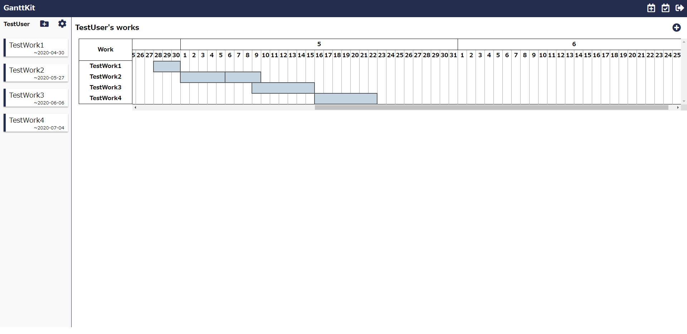

# GanttKit

## 概要

　GanttKitはスケジュール管理が苦手な人のために作成されたアプリケーションです。
スケジュールの作成には詳細な入力が必要で、根拠のないスケジューリングが原因の不毛なリスケジュールの発生を未然に防ぎます。
　また、手軽に詳細なスケジュールの作成ができるため、今まで時間のかかっていたスケジューリングの時間をあなたの趣味の時間に変えることができます。
***
## アクセス

[GanttKitのご使用はこちら](https://ganttkit.herokuapp.com/)

***

## 制作背景

　予定を立てることが苦手な私の様な人のためにこのアプリケーションは開発されました。
スケジュールが立てられない人には以下の3つの原因があると考えそれらを克服するために開発を行っています。

- 1つのタスクにかかる時間が把握できない。
- 全体だけを見て大雑把な予定を建ててしまう。
- リスケジュールが面倒

上記の3点を以下の機能で克服をします。

- 1つのタスクにかかる時間が把握できない。
  - 機械学習(回帰分析)を使用し、今までの統計から時間の自動推測を行う。
- 全体だけを見て大雑把な予定を建ててしまう。
  - RDBを使用し、タスクを3段階で詳細にスケジューリングすることで、曖昧なスケジューリングを防ぐ
- リスケジュールが面倒
  - 単純なリスケジュールであれば、自動で行う。

***

## 実際の動作
複数の仕事のスケジュールが一目でわかります。

***

### 工夫したポイント
- デザイン面
  - ボタンにはクリックできることがわかりやすいようにhoverで色が変わるアクションをつけました。
  - 直感的に操作できるよう、わかりやすいアイコンを様々なところに仕様しました。

***

## DB設計詳細
- [ER図](https://www.lucidchart.com/documents/edit/d75268f5-58f7-4575-a0f4-05fcf3f12ae6/0_0?beaconFlowId=7A1529A81DFB06B6#?folder_id=home&browser=icon)
